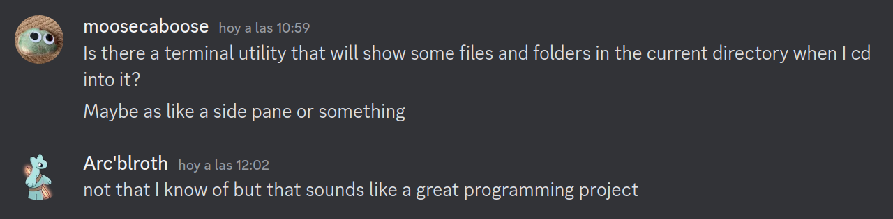

# 📟 cd2




## Usage

```sh
source ./cd2
cd somewhere
```

## Caveats

- The `builtin cd` line may need to be changed to `command cd` depending on your shell.
- zsh at least seems to forcibly clear all of the screen below once a command returns, making this a lot less useful there
